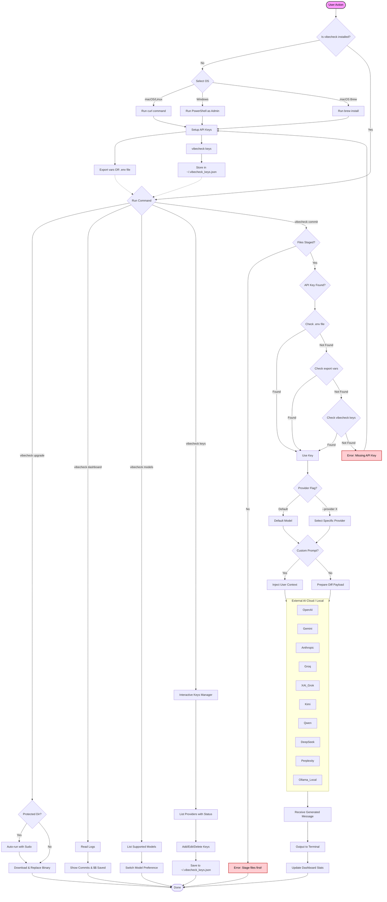

[](https://goreportcard.com/report/github.com/rshdhere/vibecheck)
[](https://codecov.io/gh/rshdhere/vibecheck)


A Cross-Platform Command-Line AI-tool for automating git commit messages by outsourcing them to LLMs. Supports multiple providers including OpenAI, Gemini, Anthropic, Groq, Grok, Kimi K2, Qwen, DeepSeek, Perplexity Sonar, and Ollama.

## Installation
### macOS/linux
```bash
curl -fsSL https://install.raashed.xyz | bash
```
### windows

```powershell
iwr https://install.raashed.xyz/install.ps1 -useb | iex
```

> **Important :** Make sure to run the command as an `administrator` using Powershell.
### macOS (brew)
```bash
brew install vibecheck
```
>  


## The Ultimate One Liner

```bash
vibecheck commit
```
> **Note :** Make sure you stage your files, right before you check that it passes the vibecheck ;)

## Demonstration


## More Features
```bash
vibecheck dashboard
```
> **Dashboard :** It keeps the tab of the commits you generated and money you saved with vibecheck
>


```bash
vibecheck keys
```

> **Keys :** It keeps your keys globally accessable to vibecheck, so that you always dont have to introduce a environmental variable
>


```bash
vibecheck models
```
> **Models :** You can switch the models for better latency and accuracy all along
>




## Environment Variables

Set up your API keys as environment variables:

> **Skip:** If you already have one of the API keys in your .env already, then it picks it up AUTOMATICALLY.

```bash
export OPENAI_API_KEY="your-openai-api-key"

export GEMINI_API_KEY="your-gemini-api-key"

export ANTHROPIC_API_KEY="your-anthropic-api-key"

export GROQ_API_KEY="your-groq-api-key"

export XAI_API_KEY="your-xai-api-key"

export MOONSHOT_API_KEY="your-moonshot-api-key"

export QWEN_API_KEY="your-qwen-api-key"

export DEEPSEEK_API_KEY="your-deepseek-api-key"

export PERPLEXITY_API_KEY="your-perplexity-api-key"

export OLLAMA_HOST="http://localhost:11434"
```

## Usage For Productivity (Mini Docs)

```bash
vibecheck commit

vibecheck commit --provider openai    # GPT-4o-mini
vibecheck commit --provider gemini    # Gemini 2.5 Flash
vibecheck commit --provider anthropic # Claude 3.5 Haiku
vibecheck commit --provider groq      # Llama 3.3 70B
vibecheck commit --provider grok      # Grok Beta
vibecheck commit --provider kimi      # Kimi K2 (Moonshot-v1-auto)
vibecheck commit --provider qwen      # Qwen Turbo
vibecheck commit --provider deepseek  # DeepSeek Chat
vibecheck commit --provider perplexity # Perplexity Sonar (sonar)
vibecheck commit --provider ollama    # gpt-oss:20b (local)

vibecheck commit --prompt "make sure to use 02 emoji's in my commit message"

vibecheck commit --provider gemini --prompt "fixed bug in parser"

vibecheck --version
vibecheck --help
```
## Upgrading

Keep vibecheck up to date with a single command:

```bash
vibecheck upgrade
```
> **Note :** If vibecheck is installed in a protected directory like `/usr/local/bin`, the upgrade command will automatically re-run itself with sudo to complete the installation.

## Configuration


> **Obtaining API Credentials :** A Contributor’s Guide to Access the Free-tier


[gemini.webm](https://github.com/user-attachments/assets/81048ed6-736d-493d-86cd-f791ea93da15)


[perplexity](https://github.com/user-attachments/assets/a85ef1eb-7f0a-466a-be39-5a8d42cb347c)


